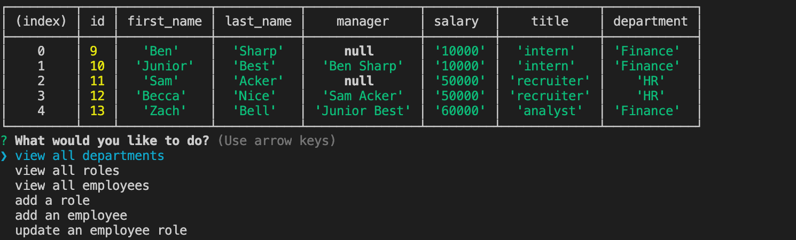

# SQL-Employee-Tracker

A command-line application to manage employee database using MySQL. You are able to view the employees, roles, and departments. You can add roles and employees. You can also update the role for each employee.



|                                         |                                         |                                                   |
| :-------------------------------------: | :-------------------------------------: | :-----------------------------------------------: |
|  [Introduction](#SQL-Employee-Tracker)  | [Table of Contents](#table-of-contents) | [Development Highlights](#development-highlights) |
|      [Installation](#installation)      |  [Page Description](#page-description)  |       [Code Hightlights](#code-highlights)        |
| [Technologies Used](#Technologies-Used) |           [Credits](#Credits)           |                [License](#License)                |

## Development Highlight

- Connected MySQL to node.js
- Create SQL queries through node.
- Join Tables
- Display, create, and update database.

## Installation

Install dependencies.

```
npm i
```

Run the app.

```
node index.js
```

## Page Description

The db directory contains the connection to MySQL through the database.js. A schema is used to create the tables and seeds is used to populate the table. Index.js is used to run the app.

## Code Highlights

SQL query to get all data from role using promises.

```JavaScript
const findRole_return = () => {
    return new Promise(resolve => {
        const sql1 = 'SELECT * FROM role';
        db.query(sql1, (err, result) => {
            if (err) throw err;
            resolve(result)
        })
    })
}
```

Role table that uses department id as a foreign key

```SQL
CREATE TABLE role
    (
        id INTEGER NOT NULL
        AUTO_INCREMENT,
        title VARCHAR
        (30) NOT NULL,
        salary decimal NOT NULL,
        department_id INT,
        FOREIGN KEY
        (department_id) REFERENCES department
        (id) ON
        DELETE CASCADE,
        PRIMARY KEY
        (id)
        );
```

## Technologies Used

### Backend Language

- [Node.js](https://nodejs.org/en/)

### Database

- [MySQL](https://www.mysql.com/)

### Dependencies

- [Inquirer](https://www.npmjs.com/package//inquirer)

## Credits

|                           |                                                                                                                                                                                                       |
| ------------------------- | ----------------------------------------------------------------------------------------------------------------------------------------------------------------------------------------------------- |
| **David Anusontarangkul** | [ LinkedIn](https://www.linkedin.com/in/anusontarangkul/) [ GitHub](https://github.com/anusontarangkul) |

## License

[](https://opensource.org/licenses/MIT)
